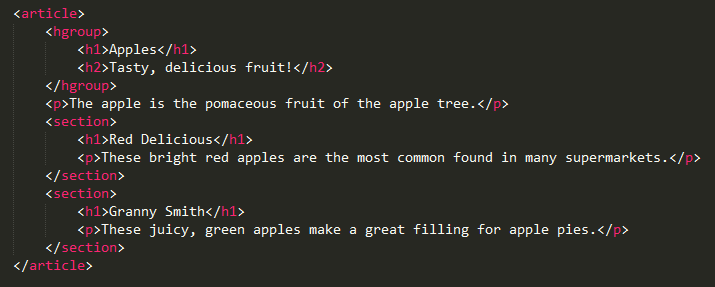
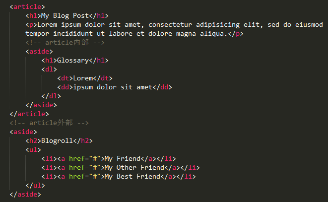
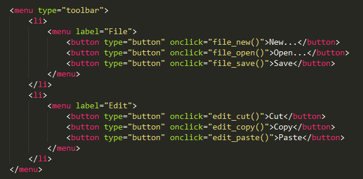
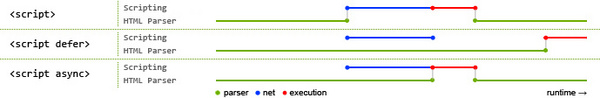

[TOC]
#HTML5新标签的使用
###HTML5与HTML4的区别
1. 更简单
2. 标签的语义化
3. 语法更宽松
4. 多设备跨平台
5. 自适应网页设计

**html5标准化写法:** 
><!DOCTYPE html>

PS: [doctype类型说明](doctype.html)，[html语义化说明](semantization.html)

###新增标签

####1、主体结构标签
* **section**
section元素描绘的是一个文档或者程序里的普通的section节（强调分块），一般来说一个section包含一个head和一个content内容块，可以与h1-h6等元素结合起来使用，标示文档的结构
如果元素的内容集中到一起显示可以表达相应的意思的话，那就可以定义成article元素，而没必要使用section元素。
section元素不是一般的容器元素，所以如果一个元素需要定义相应的style或者script脚本的话，那推荐使用div元素，section的使用条件是确保这个元素的内容能够明确地展示在文档的大纲里。


* **article**
article代表了一个文档内容的独立片段，例如，博客条目或报纸文章，article标签的内容独立于文档的其余部分（强调独立完整的内容）。
article 是一个特殊的 section 标签，它比 section 具有更明确的语义, 它代表一个独立的、完整的相关内容块。一般来说， article 会有标题部分(通常包含在 header 内)，有时也会 包含 footer 。虽然 section 也是带有主题性的一块内容，但是无论从结构上还是内容上来说，article 本身就是独立的、完整的。
当 article 内嵌 article 时，原则上来说，内部的 article 的内容是和外层的 article 内容是相关的。例如，一篇博客文章中，包含用户提交的评论的 article 就应该潜逃在包含博客文章 article 之中。


* **aside**
HTML5提供的aside元素标签用来表示当前页面或文章的附属信息部分，可以包含与当前页面或主要内容相关的引用、侧边栏、广告、nav元素组，以及其他类似的有别与主要内容的部分。
*根据目前的规范，aside元素有两种使用方法：*
    1)  被包含在article中作为主要内容的附属信息部分，其中的内容可以是与当前文章有关的引用、词汇列表等。
    2)  在article之外使用，作为页面或站点全局的附属信息部分；最典型的形式是侧边栏(sidebar)，其中的内容可以是友情链接、附属导航或广告单元等。


* **nav**
nav元素是一个可以用作页面导航的链接组，其中的导航元素链接到其他页面或当前页面的其他部分。nav元素中只存放主要的、基本的链接组。一个页面中可以有多个nav元素，作为页面整体或不同部分的导航。
*nav元素可以用于以下几个场合：*
    1）传统导航条：作用是将当前页面跳转到网站的其他主要页面上去；
    2）侧边栏导航：作用是将页面从当前文章或当前商品跳转到其他文章或其他产品页面去；
    3）页内导航：作用是在本页面几个主要的组成部分之间进行跳转；
    4）翻页操作：指在多个页面的前后页或博客网站的前后篇文章滚动。
`注意：在HTML5中，不要用menu元素代替nav元素。menu元素是用在一系列发出命令的菜单上的，是一种交互行为，更确切的说是使用在Web应用程序中的。`

* **header**
表示页面中一个内容区块或者整个页面的标题

* **footer**
表示整个页面或者页面中的一个内容区块的脚注。一般来说，他会包含创作者的姓名、创作日期以及创作者联系信息。

* **figure & figcaption**
表示一段独立的流内容，一般表示文档主体流内容中的一个独立单元（一般用于图片或视频）。使用figcaption元素为figure元素添加标题。

* **hgroup**
页面上的一个标题组合，多个标题可用hgroup包含起来，如：
```
<hgroup>
    <h1>1607</h1>
    <h2>广州html5 1607班</h2>
</hgroup>
```

* **main**
规定文档的主要内容。
元素中的内容对于文档来说应当是唯一的。它不应包含在文档中重复出现的内容，比如侧栏、导航栏、版权信息、站点标志或搜索表单。
HTML5 2013年2月标准中又新增加main标签。main表示document中body的主要内容，但不能在一个document中有多个main,不能在article,aside,footer,header或者nav中包含main。


####2、非主体结构标签
* **menu**
    1) 标签定义命令的列表或菜单。
    2) 标签用于上下文菜单、工具栏以及用于列出表单控件和命令。


* **address**
标签定义文档作者或拥有者的联系信息

* **datalist**
datalist提供一个事先定义好的列表，通过id与input的list属性关联，当在input内输入时就会有自动完成（autocomplete）的功能，用户将会看见一个下拉列表供其选择。
```
<input type="url" list="url_list" name="link" />
<datalist id="url_list"> 
    <option label="W3School" value="http://www.W3School.com.cn" />
    <option label="Google" value="http://www.google.com" />
    <option label="Microsoft" value="http://www.microsoft.com" />
</datalist>
//提示：option 元素永远都要设置 value 属性
```

* **details & summary**
显示隐藏详细信息，`open属性默认展开`

* **progress**
定义进度条
```
<progress max="100" value="76">
    <span>76</span>% 
</progress>
```

* **output**
表示不同类型的输出，比如脚本的输出
`注：必须从属于某个表单。即，必须将它书写在表单内部，或对它添加form属性。`

* **mark**
高亮显示文字，一个比较典型的应用就是在搜索结果中向用户高亮显示搜索关键词。

* **time**
标签定义日期或时间，如果标签内容不是时间或日期，则必须指定datetime属性为指定日期，如：
```
<time datatime="2016-2-14">情人节</time>
```


###新增表单元素
* 表单新增类型
    - email
    专门用来输入email地址的文本框,如果该文本框中内容不是email地址格式的，则不允许提交。但它不检查email地址是否存在。提交时可以为空，除非加上了required属性。
    - url
    专门用来输入URL地址的文本框。如果该文本框中内容不是URL地址格式的，则不允许提交。
    - number
    专门用来输入数字的文本框。在提交时会检查其中的内容是否为数字，具有min、max、step的属性。
    - range
    是用来只允话输入一段范围内数值的文本框，它具有min属性与max属性，及step属性，可以指定每次拖动的步幅。
    - search
    输入的是搜索的关键字
    - color
    用来选取颜色
    - Date pickers (date, month, week, time, datetime, datetime-local)
        + date：选取日、月、年
        + month：选取月、年
        + week：选取周和年
        + time：选取时间（小时和分钟）
        + datetime：选取时间、日、月、年（UTC 时间）
        + datetime-local：选取时间、日、月、年（本地时间）

* 表单属性:
    - autocomplete
        自动完成功能，是一个节省输入时间，同时也十分方便的功能。只有三种：
        + on：可是显示指定候补输入的数据列表，使用datalist元素与list属性提供候补输入的数据列表；
        + 自动完成时(属性值为空字符串)，可以讲该datalist元素中的数据作为候补输入的数据在文本框中显示
        + off：关闭自动完成功能
    - autofocus
    自动获得焦点
    - list
    指定选项列表，通常与datalist标签配合使用
    - placeholder
    文本框处于未输入状态时文本框中显示的输入提示。
    - min, max, step
        - min：最小值
        - max：最大值
        - step：数字间隔
    - multiple
    允许输入多个值，如文件上传，email等
    - pattern (regexp)
    设置验证规则，支持正则表达式
    - required
    验证输入不能为空，提交时有提示信息
    - form overrides (form, formaction, formenctype, formmethod, formnovalidate, formtarget)
    可以给表单元素设置单独的属性，设置后会覆盖form标签上的同名属性

* 表单验证
    + 显性验证
    除了对input元素来添加属性进行元素内容有效性的自动验证外，在HTML5中，form元素与input元素（包括select和textarea）都具有一个checkValidity方法，调用该方法可以显式的对表单内所有元素内容或者单个元素内容进行有效的验证。checkValidity方法以boolean的形式返回结果。
    ```
    email.checkValidity();
    ```
    + 自动验证
        HTML5增加了大量在提交时对表单及表单元素内容有效性验证的功能。
        + 类型验证：number,email,url等
        + 属性验证：min,max,step,required,pattern等
    + 取消验证
    可以对form表单添加novalidate属性，即使form表单中的input添加了required，也将不进行验证

###新增属性
* 全局属性
    - contenteditable：规定是否允许用户编辑内容
    - tabindex：tab键自动获取焦点索引
    - draggable：规定是否允许用户拖动元素
    - hidden：规定该元素是无关的。被隐藏的元素不会显示
    - spellcheck：规定是否必须对元素进行拼写或语法检查
    - data-*：自定义属性。HTML文档的创作者可以定义他们自己的属性，必须以 "data-" 开头

* 其他属性
    - reversed & start & type (ol)
        + reversed：对列表顺序进行降序
        + start：number类型,规定有序列表的起始值
        + type：规定在列表中使用的标记类型，值为(1,A,a,I,i)。
    - async & defer (srcipt)：异步加载js文件
        - 默认情况下，浏览器会立即加载并执行指定的脚本，“立即”指的是在渲染该 script 标签之下的文档元素之前，也就是说不等待后续载入的文档元素，读到就加载并执行。
        ```
        <script sr="js/common.js"></script>
        ```
        - 有 async，加载和渲染后续文档元素的过程将和 script.js 的加载与执行并行进行（异步）。
        ```
        <script sr="js/common.js" async></script>
        ```
        - 有 defer，加载后续文档元素的过程将和 script.js的加载并行进行（异步），但是script.js的执行要在所有元素解析完成之后，DOMContentLoaded 事件触发之前完成。
        ```
        <script sr="js/common.js" defer></script>
        ```
        
        `蓝色线代表网络读取，红色线代表执行时间，这俩都是针对脚本的；绿色线代表 HTML 解析。`
    - scoped(style)
    默认样式会应用到页面所有的匹配元素，但如果使用该属性，则样式仅仅应用到 style元素的父元素及其子元素。


###其他元素
####video
定义视频，比如电影片段或其他视频流，可配合source标签定义媒介源
>
视频的组成部分：画面、音频、编码格式
常见的视频格式：
1. Ogg => 带有Theora视频编码+Vorbis音频编码的Ogg文件，支持的浏览器:Firefox、Chrome、Opera
2. MEPG4 => 带有H.264视频编码+AAC音频编码的MPEG4文件，支持的浏览器: Safari、Chrome
3. WebM => 带有VP8视频编码+Vorbis音频编码的WebM格式，支持的浏览器: IE、Firefox、Chrome、Opera
视频编码：H.264、Theora、VP8(google开源)

####audio
定义音频，比如音乐或其他音频流，可配合source标签定义媒介源
>
常见的音频格式：
1. Ogg => 免费，支持的浏览器: Chrome、Firefox、Opera
2. MP3 => 收费，支持的浏览器: IE、Chrome、Safari
3. Wav => 收费，支持的浏览器: FFirefox、OOpera、Safari
编码：AAC、MP3、Vorbis

**html属性**

- width/height: 视频宽高
- poster: 带有预览图（海报图片）的视频播放器
- controls: 向用户显示控件，比如播放按钮
- autoplay: 视频在就绪后马上播放
- loop: 播放完成后重复播放
- preload：视频在页面加载时进行加载，并预备播放
- src: 要播放的视频的 URL

**以下javascript属性/方法适用于audio和video标签**

* 属性
    + controls:   显示或隐藏用户控制界面
    + autoplay:  媒体是否自动播放
    + loop: 媒体是否循环播放
    + currentTime:  开始到播放现在所用的时间
    + duration:  媒体总时间(只读)
    + volume:   0.0-1.0的音量相对值
    + muted:   是否静音
    + autobuffer:   开始的时候是否缓冲加载，autoplay的时候，忽略此属性
    + paused:   媒体是否暂停(只读)
    + ended:   媒体是否播放完毕(只读)
    + error:  媒体发生错误的时候，返回错误代码 (只读)
    + currentSrc:   以字符串的形式返回媒体地址(只读)
* 方法
    + play():  媒体播放
    + pause():  媒体暂停
    + load():  重新加载媒体
* 事件
    + canplay: 当浏览器可以开始播放该音视频时触发该事件
    + canplaythrough: 当浏览器可以开始播放该音视频到结束而无需因缓冲而停止时触发该事件(缓存完毕)
    + progress：当获取到媒体数据时产生该事件
    + suspend：当获取不到数据时产生该事件
    + stalled：当试图获取媒体数据，但数据还不可用时产生该事件
    + play：当媒体播放时产生该事件
    + pause：当媒体暂停时产生该事件
    + ended：当前播放列表结束时产生该事件
    + timeupdate：当前播放位置发生改变时产生该事件
    + ratechange：当播放倍数改变时产生该事件（快进快退）
    + durationchange：当媒体的总时长改变时产生该事件
    + volumechange：当前音量发生改变时产生该事件
    + loadstart：当开始查找媒体数据时产生该事件
    + loadedmetadata：当收到总时长，分辨率和字轨等metadata时产生该事件
    + loadeddata：当加载媒体数据时产生该事件
    + waiting：当视频因缓冲下一帧而停止时产生该事件
    + playing：当媒体从因缓冲而引起的暂停和停止恢复到播放时产生该事件
    + seeking：当用户正执行跳转时操作的时候产生该事件
    + seeked：当用户完成跳转时产生该事件
    + emptied：当前播放列表为空时产生该事件
    + abort 当音视频加载被异常终止时产生该事件
    + error 当加载媒体发生错误时产生该事件
* video额外特性 
    + poster:   视频播放前的预览图片
    + width、height:   设置视频的尺寸
    + videoWidth、 videoHeight:   视频的实际尺寸(只读)

####canvas
表示图形，比如图标和其他图像。这个元素本身没有行为，仅提供一块画布，但它把一个绘图API展现给客户端js，以使脚本能够把想绘制的东西绘制到这块画布上


###低版本ie兼容语义化新标签方法
* 通过创建标签的方式实现兼容
```
<script type="text/javascript">
  var ele="abbr,article,aside,audio,canvas,datalist,details,figure,footer,header,hgroup,mark,menu,meter,nav,output,progress,section,time,video").split(',');
  for(var i=0;i<ele.length;i++){
    document.createElement(e[i]);
  }
</script>
<style> 
    article, aside, canvas, details, figcaption, figure,footer, header, hgroup, menu, nav, section, summary{display: block;} 
</style>
```
* Html5shiv方案
html5shiv主要解决HTML5提出的新的元素不被IE6-8识别，这些新元素不能作为父节点包裹子元素，并且不能应用CSS样式。
html5shiv的使用非常的简单，考虑到IE9是支持html5的，所以只需要在页面head中添加如下代码即可：
```
<!--[if lt IE 9]>
<script type="text/javascript" src="js/html5shiv.js"></script>
<![endif]-->
```