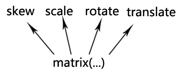

[TOC]
#CSS3变形与过渡

###CSS3变形transform

####1. 2D变换
* 了解坐标系


* translate(x,y)
根据给定的参数x,y，元素相对与其当前位置移动
    - translateX(length)： 指定对象X轴（水平方向）的平移 
    - translateY(length)： 指定对象Y轴（垂直方向）的平移 

* rotate(angle) 
元素顺时针旋转给定的角度。允许负值，元素将逆时针旋转，需先有transform-origin属性的定义([查看详情](#transform-originxy))。

* scale(number,number)
元素的尺寸会增加或减少（2D缩放）。第一个参数对应X轴，第二个参数对应Y轴。如果第二个参数未提供，则默认取第一个参数的值
    - scaleX(number)： 指定对象X轴的（水平方向）缩放 
    - scaleY(number)： 指定对象Y轴的（垂直方向）缩放 
`scale(2,4) //把宽度转换为原始尺寸的 2 倍，把高度转换为原始高度的 4 倍`

* skew(angle,angle)
指定对象skew transformation（斜切扭曲）。第一个参数对应X轴，第二个参数对应Y轴。如果第二个参数未提供，则默认值为0 
    - skewX(angle)： 指定对象X轴的（水平方向）扭曲 
    - skewY(angle)： 指定对象Y轴的（垂直方向）扭曲
`skew(30deg,20deg) 围绕 X 轴把元素翻转 30 度，围绕 Y 轴翻转 20 度`

* matrix(a,b,c,d,e,f)
把所有 2D 转换方法组合在一起，实现旋转、缩放、移动以及倾斜元素。以一个含六值的(a,b,c,d,e,f)变换矩阵的形式指定一个2D变换，
* 变换矩阵：[a,b,c,d,e,f]

无论是旋转还是拉伸什么的，本质上都是应用的matrix()方法实现的（修改matrix()方法固定几个值），只是类似于transform:rotate这种表现形式，我们更容易理解，记忆与上手。

####2. 3D变换


###transform-origin(x,y)
>以某个原点进行转换，该属性提供2个参数值：
1. 如果提供两个，第一个用于横坐标，第二个用于纵坐标。 
2. 如果只提供一个，该值将用于横坐标；纵坐标将默认为50%。 

* percentage： 用百分比指定坐标值。可以为负值。 
* length： 用长度值指定坐标值。可以为负值。 
* left： 指定原点的横坐标为left 
* center①： 指定原点的横坐标为center 
* right： 指定原点的横坐标为right 
* top： 指定原点的纵坐标为top 
* center②： 指定原点的纵坐标为center 
* bottom： 指定原点的纵坐标为bottom 


###css3过渡transition
>通过 CSS3，我们可以在不使用 Flash 动画或 JavaScript 的情况下，
当元素从一种样式变换为另一种样式时为元素添加效果

*要实现这一点，必须规定两项内容：*
1. 规定您希望把效果添加到哪个 CSS 属性上
2. 规定效果的时长(如果时长未规定，则不会有过渡效果，因为默认值是0)
`transition:transform 3s`

**以上为简写，其中包含以下几个属性：**

* transition-property
规定应用过渡的 CSS 属性的名称，多个属性以逗号分隔
* transition-duration
定义过渡效果花费的时间。默认是 0
* transition-timing-function
    规定过渡效果的时间曲线。
    - linear： 线性过渡。 
    - ease(默认)： 平滑过渡。 
    - ease-in： 由慢到快。 
    - ease-out： 由快到慢。 
    - ease-in-out： 由慢到快再到慢。 
    - cubic-bezier(number, number, number, number)： 特定的贝塞尔曲线类型，4个数值需在[0, 1]区间内
* transition-delay
设置对象延迟过渡的时间。默认是0


###各大浏览器兼容写法
```
    Webkit(Chrome/Safari)   -webkit-transform
    Gecko(Firefox)  -moz-transform
    Presto(Opera)   -o-transform
    Trident(IE) -ms-transform
    W3C transform
```


